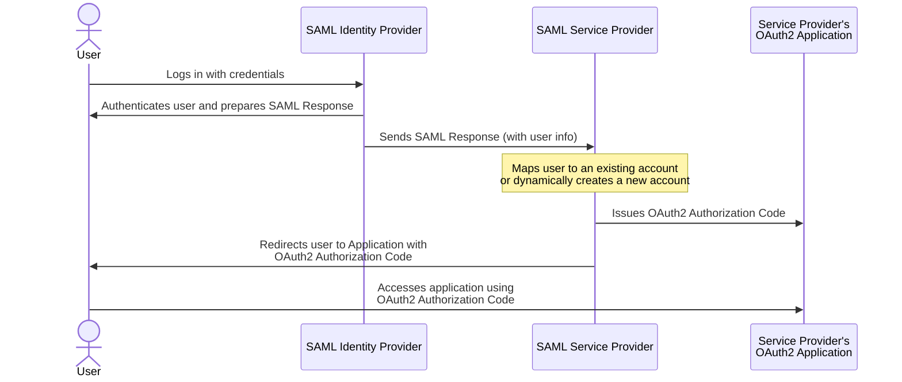
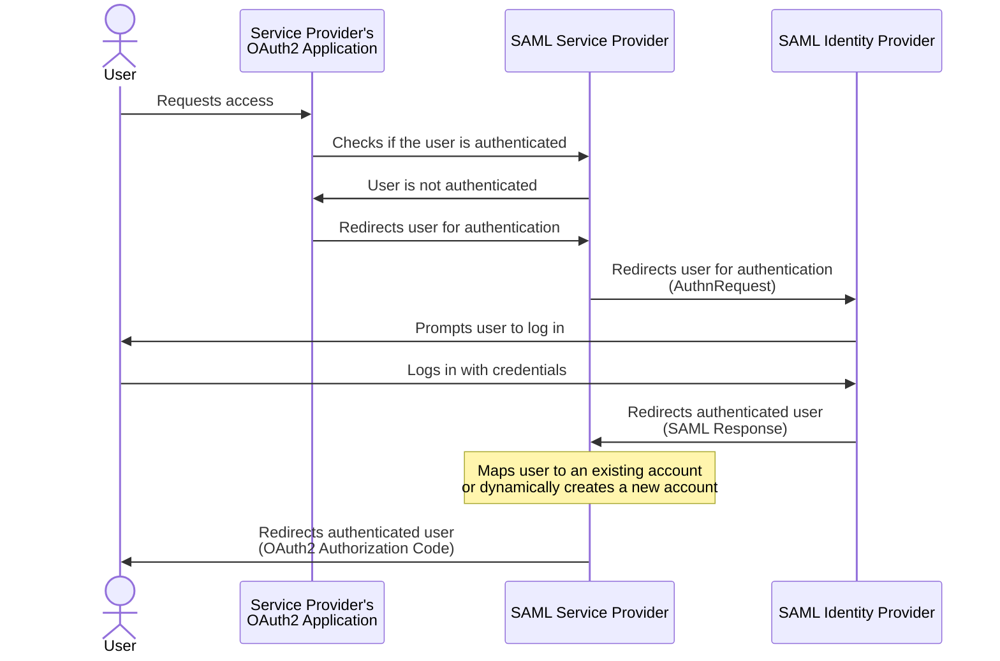

# Keycloak SAML 2.0 SSO Demo

The primary goal of this project is to establish SAML authentication system using Keycloak. This will involve
configuring two Keycloak instances: one as the Identity Provider (IdP) and the other as the Service Provider (SP).
Additionally, we will have a demo application that will serve as a client secured by the Keycloak SP, ensuring that
all authentication workflows are exclusively handled through SAML. This comprehensive setup will demonstrate seamless
integration and secure authentication flows between the IdP, SP, and the demo application.

### This demo covers 2 kinds of SAML-based SSO flows

- IdP Initiated Flow
- Service Provider Initiated Flow

### IdP Initiated Flow



In the **IdP Initiated Flow**, the process begins at the Identity Provider (IdP). This flow is typically used when a
user wants to access a service without having to navigate to the Service Provider (SP) first. Here's how it works:

1. **User Access**: The user navigates directly to the IdP and authenticates. This can be done via a login page or a
   dashboard.
2. **SAML Assertion Generation**: Once authenticated, the IdP generates a SAML assertion containing information about
   the user and their authentication status.
3. **Redirection to SP**: The IdP redirects the user to the SP's assertion consumer service URL. This redirection
   includes the SAML assertion, which is typically transmitted via an HTTP POST request.
4. **Assertion Validation**: The SP receives the assertion and validates it to ensure it is genuine and has not been
   tampered with. This usually involves checking the signature and the issuer.
5. **User Access Granted**: Upon successful validation, the SP grants access to the user, allowing them to use the
   service.

### Benefits

- **User Experience**: Simplifies the login process for users who often access the IdP directly.
- **Centralized Authentication**: Allows for centralized management of user identities and access controls.

### Service Provider Initiated Flow



In the **Service Provider Initiated Flow**, the user begins at the Service Provider (SP) and is redirected to the
Identity Provider (IdP) for authentication. This flow is common when users are accessing a service that requires them to
log in. Here's how it works:

1. **User Access**: The user navigates to the SP and tries to access a protected resource.
2. **Redirection to IdP**: The SP detects that the user is not authenticated and redirects them to the IdP's login page.
   This redirection often includes a SAML request that specifies the SP's details and the requested resource.
3. **User Authentication**: The user enters their credentials on the IdP's login page. Upon successful authentication,
   the IdP generates a SAML assertion.
4. **Redirection Back to SP**: The IdP redirects the user back to the SP's assertion consumer service URL, including the
   SAML assertion in the response.
5. **Assertion Validation**: The SP receives and validates the SAML assertion, ensuring that it is legitimate.
6. **Access Granted**: If the assertion is valid, the user is granted access to the requested resource on the SP.

### Benefits

- **User Convenience**: Users can start at the SP, which is often more intuitive for accessing specific applications.
- **Security**: Ensures that the user is authenticated before accessing sensitive information or services.

Both flows facilitate Single Sign-On (SSO), allowing users to access multiple services without repeatedly entering
credentials, enhancing both user experience and security.

## Capabilities Covered

### Login via IdP

### Login via SP

### Create a user in SP using the IdP user data after authentication

### Simplified User Onboarding into SP

- Removes the extra step for new users, allowing them to log in without asking them to enter their
  username, first name, and last name during their first login.

### User Attribute Mapping

- **User Properties Mapping**: Automatically transfers `firstName` and `lastName` from the Identity Provider (IdP) to
  the Service Provider (SP) user profile.
- **Email as Username**: Uses the user's email from the IdP as their username in the SP for easier access.
- **Custom Attribute Support**:
    - Maps additional information, such as `tenant-id`, to ensure users are linked to the correct
      tenant.
    - Allows the assignment of users to specific groups in the SP based on custom attributes from
      the IdP.

## Run the full setup

```shell
./start.sh
```

Access the setup from http://localhost

### Check the IdP and SP auth server configurations

| IDP Keycloak              | SP Keycloak              |
|---------------------------|--------------------------|
| http://localhost/idp-auth | http://localhost/sp-auth |
| Username: `admin`         | Username: `admin`        |
| Password: `admin`         | Password: `admin`        |
| Realm: `my-idp`           | Realm: `my-sp`           |

### From IdP

| Single Sign-on from IdP                              | Single Sign-out from IdP                             |
|------------------------------------------------------|------------------------------------------------------|
| 1. Open [http://localhost/idp](http://localhost/idp) | 1. Open [http://localhost/idp](http://localhost/idp) |
| 2. Click `Open SP App`                               | 2. Click `Logout`                                    |
| 3. Enter Username: `idpuser`, Password: `test`       | 3. You should be logged out from both IdP and SP     |
| 4. Click `Sign in`                                   |                                                      |
| 5. You are now logged into both apps                 |                                                      |

### From SP

| Single Sign-on from SP                             | Single Sign-out from SP                            |
|----------------------------------------------------|----------------------------------------------------|
| 1. Open [http://localhost/sp](http://localhost/sp) | 1. Open [http://localhost/sp](http://localhost/sp) |
| 2. Click on `SSO with IdP via SAML`                | 2. Click `Logout`                                  |
| 3. Enter Username: `idpuser`, Password: `test`     | 3. You should be logged out from both IdP and SP   |
| 4. Click `Sign in`                                 |                                                    |
| 5. You are now logged into both apps               |                                                    |


## [Link to the video demo](https://www.youtube.com/watch?v=aUVNjNNhQik)

https://github.com/user-attachments/assets/b743d71f-f34b-4ab3-b38e-c35fb4168ad5

## Potential Improvements

- [ ] Redirections to specific URLs using `RelayState`
- [ ] Redirections to IdP/SP app on Single Sign-out
